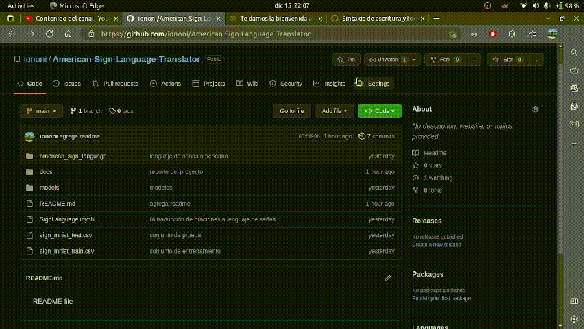

# **Traductor de Lenguaje Natural a Lenguaje de Señas**
Fundamentalmente, el propósito de proyecto es lograr aplicar los conocimientos adquiridos durante el curso _Tópicos Avanzados de Inteligencia Artificial_, entre los cuales destacan:

* Procesamiento de imágenes
    * Filtros
    * Modelos de color
    * Detecció de bordes
    * Thresholding
* _Big Data_
* _Machine Learning_
* Redes Neuronales

Adicionalmente, se buscaba combatir una problemática actual en la cual muchos mexicanos y mexicanas se ven involucrados: la exclusión de personas sordo-mudas. Según datos del _INEGI_, alrededor de 250 mil personas en México utilizan el lenguaje de señas. Sin embargo, poco se ha invertido en programas sociales que ayuden a fomentar la cultura de inclusión hacia este sector marginado de la población mexicana.

Este proyecto busca ser un puente entre los mexicanos para romper la barrera que impide la comunicación entre la población, asimismo para garantizar espacios inclusivos y permitir que las personas sordo-mudas se puedan integrar a la sociedad sin que la población tenga que aprender forzosamente el lenguaje de señas.

Para poder realizarlo, se implementa una IA que fue entrenada con un conjunto de datos (imágenes) para reconocer la posición de manos que representa cada una de las letras del lenguaje de señas a través de algoritmos de procesamiento de imágenes y algoritmos de aprendizaje implementando redes neuronales.

# **Especificaciones**
El proyecto fue realizado con las siguientes herramientas:
* [Visual Studio Code](https://code.visualstudio.com/)
* [Jupyter Notebooks](https://jupyter.org/)
* [Tensorflow](https://www.tensorflow.org/?hl=es-419)
* [Numpy](https://numpy.org/)
* [Scikit-learn](https://scikit-learn.org/)
* [Pandas](https://pandas.pydata.org/)
* [Matplotlib](https://matplotlib.org/)

Si desea ejecutar el proyecto localmente debe asegurarse de que su equipo tenga instalados los componentes de software anteriormente listados. Por otra parte, puede utilizar entornos en la nube como [Google Colab](https://colab.research.google.com/) que ya cuentan con todas las anteriores dependencias integradas.

> NOTA: en el caso de que haya decidido utilizar algún entorno de ejecución en la nube como _Google Colab_ solamente deberá descargar la notebook y subirla.

# **Descargando el repositorio**
Para tener una copia del proyecto en su equipo de manera local, debe seguir los siguientes pasos:

### **1. Clonar el repositorio**
Este caso aplica en caso de que usted tenga instalado en su equipo la herramienta de control de versiones _[git](https://git-scm.com/)_ En caso contrario puede omitir esta sección y continuar al siguiente apartado: _[2. Descargar archivo comprimido ZIP](https://github.com/iononi/American-Sign-Language-Translator#2.-descargar-archivo-comprimido-zip)_.

**Pasos**

1. Abrir la terminal.
2. Posicionarse en la ruta donde quiere que se clone el repositorio
3. Escribir el siguiente comando:
    ```bash
    git clone https://github.com/iononi/American-Sign-Language-Translator.git
    ```

¡Listo! Con estos sencillos pasos ha creado una copia del repositorio en su computadora. Ahora puede continuar a la sección _[Modo de uso](https://github.com/iononi/American-Sign-Language-Translator.git#modo-de-uso)_.

### **Descargar archivo comprimido ZIP**
Para ello simplemente debe hacer clic sobre el botón verde que dice `Code` y se desplegará un submenú donde aparecerá la opción _Download ZIP_. Debe hacer clic en esta opción y en breve debería observar que la descarga ha comenzado en la sección de descargas de su navegador.



# Modo de uso
Ya sea que haya clonado el repositorio, descargado el archivo comprimido ZIP o haya desacargado la notebook para usarla solo deberá abrir su espacio de trabajo (_Visual Studio Code_ o _Google Golab_) y deberá ejecutar celda tras celda haciendo clic en el ícono de play que aparece a la izquierda de cada celda.